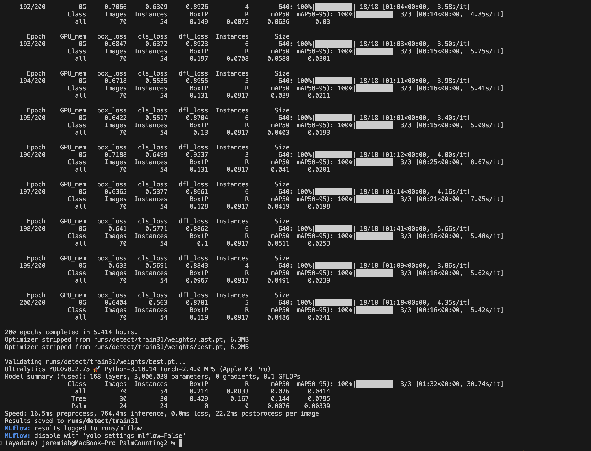

# PalmTreeProject
 
This project fine-tunes the YOLOv8 model on custom object detection data (Palm Trees Detection). It is designed with a modular approach, Dockerized, and integrates MLOps tools like DVC and MLflow for experiment tracking.

## Project Structure

- `data/`: Contains raw and processed data.
- `src/`: Contains the core code for data loading, model training, and evaluation.
- `models/`: Contains the YOLOv8 model implementation.
- `src/`: Contains utility functions for data processing, model evaluation etc.
- `pipelines/`: Containes codes on ingestion, preparation,training and evaluation pipelines
- `docker/`: Docker and Docker Compose files for containerization.
- `mlflow/`: MLflow configuration files. 
- `tests/`: Unit tests for the model and utility functions.
- `requirements.txt`: Python dependencies.

#### Training Ouput



## Setup Instructions

1. Clone the repository:

   ```bash
   git clone https://github.com/IshayaJAyock/Palm_Tree_Project.git
   cd Palm_Tree_Project
   ```

2. Install Requirements
    ```bash
    pip install -r requirements.txt
    ```

3. Ingesting the data from Kaggle (run the ingest data pipeline) or you can download the data directly to a folder locally and unzip it:

    ```bash 
    python pipelines/ingest_data_pipeline.py
    ``` 
4. Preprocess your data by converting the images and annotations to coco format:

    ```bash
    python pipelines/preprocess_data_pipeline.py
    ```
5. Training the Model:

    ```bash 
    python pipelines/training_pipeline.py
    ``` 

6. Evaluate the model:

    ```bash
    python pipelines/evaluate_pipeline.py

7. Add Raw Data to DVC (After adding the raw data to DVC, commit the changes to you repository):

    ```bash
    dvc add data/raw_data/
    ``` 
8. Commit the Changes to Git:

    ```bash
    git add data/raw.dvc .gitignore
    git commit -m "Added raw data versioning with DVC"
    ```
9. Add Processed Data to DVC (After adding the processed data commit the changes to your repository):

    ```bash
    dvc add data/palmdata/
    ``` 
10. Commit the Changes to Git:

    ```bash
    git add data/raw.dvc .gitignore
    git commit -m "Added processesd versioning with DVC"
    ```
11. Push Data to Remote Storage (if already setup remote server;you can use google drive (optional))
    ```bash
    dvc push
    ``` 
### Steps to Build and Run the Docker Container

1. Build the Docker Image
    Use the Docker CLI to build the Docker image:
    ```bash 
    docker build -t palmtree-app .
    ```
2. Run the Docker Container ()
   Once the image is built, you can run the container:

    ```bash
    docker run -d -p 5000:5000 palmtree-app
    ``` 